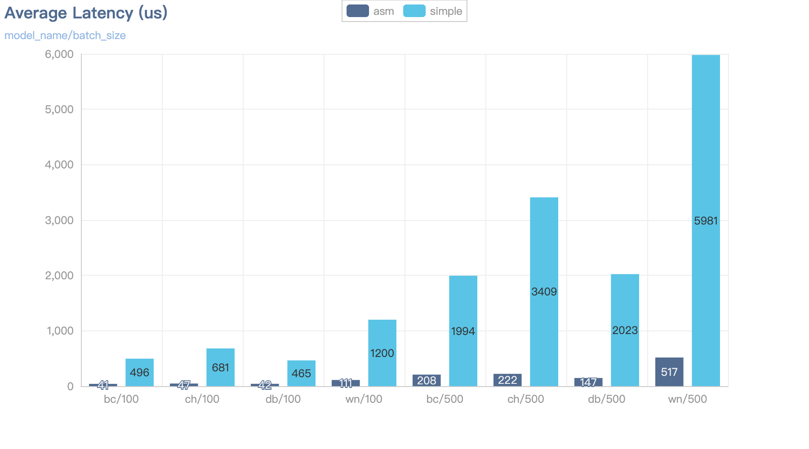

# Treetops


[](https://github.com/horoc/treetops/actions/workflows/gradle.yml)


Fast LightGBM tree model interference Java library which is based on ASM dynamic code generation framework.

## How Fast

<div align=center>

</div>

### Specification

- Asm: Generated lightGBM predictor based on ASM framework.
- Simple: Tree-based data structure predictor which follows the LightGBM cpp official implementation.

### Test Models

- bc: model trained by breast cancer dataset (100 trees, binary)  
- ch: model trained by california housing dataset (100 trees, regression) 
- db: model trained by diabetes dataset (100 trees, regression) 
- wn: model trained by wine dataset (300 trees, classification)

### Environment

- CPU: Intel Xeon Cooper Lake 3.4GHz, 4C
- Memory: 8G
- JDK: zulu JDK 8
- Tools: Jmh, test config see `AverageTimeBenchmarkTemplate.java`

## Quick Start

```java
    Predictor predictor = TreePredictorFactory.newInstance("model_v0", modelFilePath);
    predictor.predict(features);
```

## Core Idea

**<u>What treetops mainly do is translate the model file into a hardcode class instead of storing it in a tree-based data structure, and that's the core idea of treetops.</u>**

### Example

For example, the following configuration is one of the trees in a model.

```
Tree=0
num_leaves=4
num_cat=0
split_feature=1 2 2
split_gain=0.568011 0.483606 0.45669
threshold=0.73144941452196321 0.90708366268745222 0.85551601478390116
decision_type=2 2 2
left_child=1 -1 -2
right_child=2 -3 -4
leaf_value=0.49510661266514339 0.50645382200299838 0.50688948369558862 0.49040602357823876
leaf_weight=326 114 39 21
leaf_count=326 114 39 21
internal_value=0.498415 0.496366 0.503957
internal_weight=0 365 135
internal_count=500 365 135
is_linear=0
shrinkage=1
```

The output decision value of this tree is based on every internal and leaf node's split strategy and value.

According to the config, we can see there are three internal nodes and four leave nodes. If we store this tree in a tree-based data structure, we would need to iterate from the root to the leaves to make a decision. However, this process can result in lots of memory accesses and function calls. This also affects the hit rate of the CPU instruction cache.

If we hardcode the tree structure, we could optimize this overhead.

A generated tree decision function is like this:

```
private tree_0([D)D
  ... ...
    IFEQ L0
    GOTO L1
   L0
   FRAME APPEND [D]
    DLOAD 2
    LDC 0.7314494145219632
    DCMPG
    IFGE L2
    GOTO L1
   L1

   ... ...

   L8
   FRAME SAME
    LDC 0.49040602357823876
    DRETURN
    MAXSTACK = 4
    MAXLOCALS = 4
```

the corresponding java code :

```java
    private double tree_0(double[] var1) {
        double var2 = var1[1];
        if (var2 == var2 && !(var2 < 0.7314494145219632D)) {
            var2 = var1[2];
            return var2 == var2 && !(var2 < 0.8555160147839012D) ? 0.49040602357823876D : 0.5064538220029984D;
        } else {
            var2 = var1[2];
            return var2 == var2 && !(var2 < 0.9070836626874522D) ? 0.5068894836955886D : 0.4951066126651434D;
        }
    }
```

we precompute the decision rules and use conditional statements to evaluate input features based on the tree config. This can be particularly advantageous for large trees, as dynamic traversal can become a significant bottleneck.

## Author

* **Chen Zhou** - *Initial work* - [ChenZhou](https://github.com/horoc)

See also the list of [contributors](https://github.com/horoc/treetops/contributors) who participated in this project.

## License

This project is licensed under the MIT License - see the [LICENSE.md](LICENSE.md) file for details
